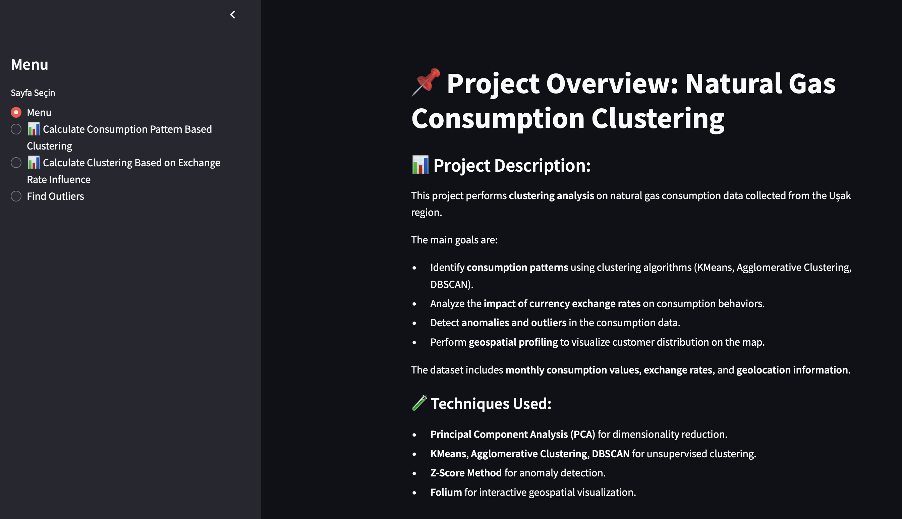
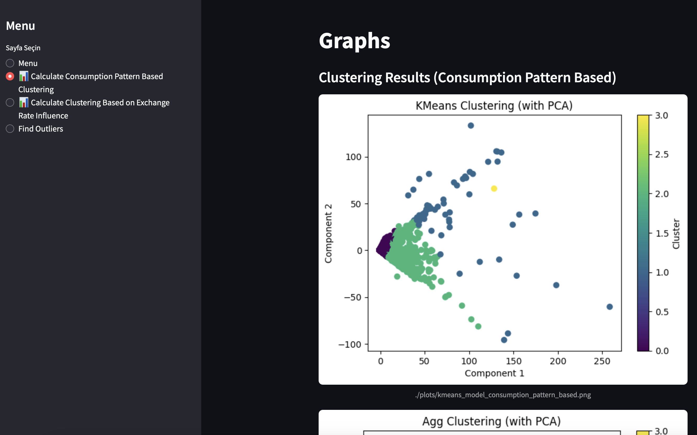
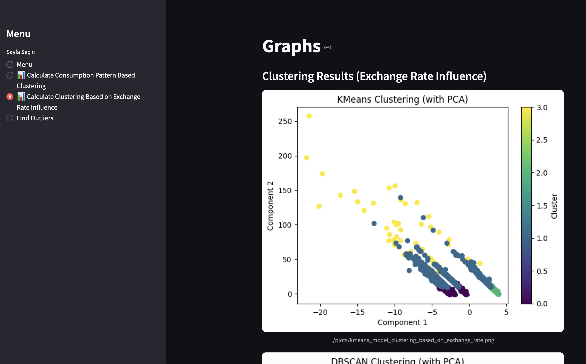
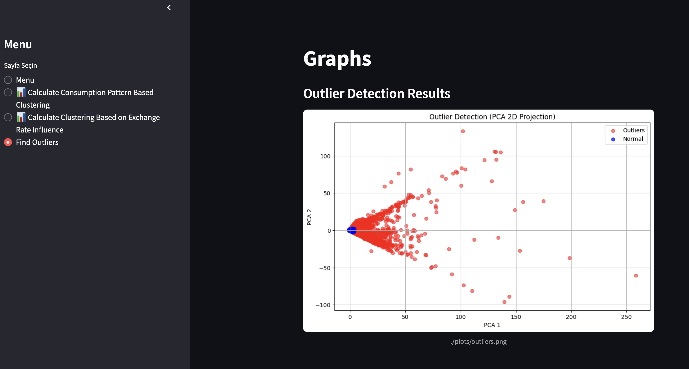

# 🔥 Natural Gas Consumption Clustering & Anomaly Detection 🧭

This project focuses on **unsupervised clustering, anomaly detection, and geospatial profiling** of natural gas consumption data collected from the **Uşak region**.  
It aims to segment consumers based on their consumption patterns, identify anomalies, and analyze geographical consumption profiles using various machine learning techniques.

---

## 📌 Project Objectives

- 🏷️ **Consumer Segmentation:**  
  Group consumers with similar monthly consumption behaviors using clustering techniques.

- 💹 **Exchange Rate Influence Analysis:**  
  Understand the potential impact of **currency exchange rates** on gas consumption patterns.

- 🚩 **Outlier Detection:**  
  Identify **anomalous consumption behaviors** (possible fraud, errors, or unusual usage patterns) using statistical methods.

---

## 🧠 Techniques and Algorithms Used

| Method / Algorithm              | Purpose                                     |
|----------------------------------|---------------------------------------------|
| **Principal Component Analysis (PCA)** | Dimensionality reduction for better visualization and analysis. |
| **KMeans Clustering**           | Identify consumption-based customer clusters. |
| **Agglomerative Clustering**    | Hierarchical grouping of similar consumers. |
| **DBSCAN (Density-Based Clustering)** | Cluster detection based on density and anomaly isolation. |
| **Z-Score Based Outlier Detection** | Statistical anomaly detection on consumption data. |
| **Isolation Forest (Optional)** | Machine learning-based anomaly detection. |


---

## 🗃️ Dataset Overview

- **Monthly consumption data** (January to December) for each customer.
- **Currency exchange rates** (e.g., USD/TRY, EUR/TRY) for selected months.
- **Geographical location information** (latitude and longitude).

---

## 🚀 Project Features

- 📊 Multi-model clustering and comparative analysis.
- 🧐 Detailed outlier detection and anomaly marking.
- 🌍 Interactive mapping of customer locations.
- 🎨 Clean, interactive **Streamlit-based web interface**.
- 📌 Automatically saved clustering visualizations (`.png` plots).

---
## 🧠 Technologies Used

| Technology               | Purpose                                                               |
|---------------------------|----------------------------------------------------------------------|
| **Python 3.9+**           | Programming language                                                 |
| **Pandas**                | Data manipulation and preprocessing                                  |
| **NumPy**                 | Numerical calculations                                               |
| **Scikit-learn**          | Clustering models (KMeans, DBSCAN, Agglomerative), anomaly detection |
| **SciPy**                 | Statistical analysis, Z-Score calculation                            |
| **Matplotlib**            | Data visualization (plots and charts)                                |
| **Openpyxl**              | Reading Excel datasets                                               |
| **Streamlit**             | Interactive web interface                                            |
| **Streamlit-option-menu** | Web app navigation / sidebar control                                 |
| **Pillow (PIL)**          | Image processing (if any visual manipulations used)                  |

---
```
## 🏗️ Project Structure
. 
├── main.py # Streamlit web app (GUI and logic) 
├── clustering_usak.py # Clustering logic and analysis functions 
├── plots/ # Pre-generated clustering result images (PNG) 
├── requirements.txt # Python dependencies 
├── media
└── README.md # This file
```
---
## 📂 Installation

1. Clone the repository:
```bash
> git clone https://github.com/BurakCANKURT/usak-natural-gas-clustering.git

> cd usak-natural-gas-clustering
```

2. (Optional but recommended) Create and activate a virtual environment:
```bash
> python -m venv venv

# For Linux/Mac:
> source venv/bin/activate

# For Windows:
> venv\Scripts\activate
```

3. Install the required packages:
```bash
> pip install -r requirements.txt
```
---

## 🧪 How to Run the Project

### 1. Install dependencies:
```bash
> pip install -r requirements.txt
```
### 2. Run the Streamlit application:
```
> streamlit run main.py
```


## 🖼️ Demo Screenshots

### 🟢 Menu Page (Project Overview):


### 🟡 Calculate Consumption Pattern Based Clustering:


### 🔵 Calculate Clustering Based on Exchange Rate Influence:


### Find Outliers

---

📄 Data Disclaimer:
The datasets used in this project were provided by my university professor solely for educational purposes.
These datasets are not publicly distributed and are used here for demonstration and academic showcase only.


🏆 What I Learned (Folium’suz Doğru Versiyon)

- Applying unsupervised learning techniques such as KMeans, Agglomerative Clustering, and DBSCAN on real-world consumption data for customer segmentation.
- Understanding and implementing anomaly detection methods like Z-Score analysis and Isolation Forest to identify unusual consumption behaviors.
- Utilizing Principal Component Analysis (PCA) for dimensionality reduction and improving cluster visualization clarity.
- Combining exchange rate data with consumption patterns to analyze the potential external influences on customer behaviors.
- Building an interactive, user-friendly Streamlit-based dashboard to present clustering results and anomaly detection outcomes effectively.
